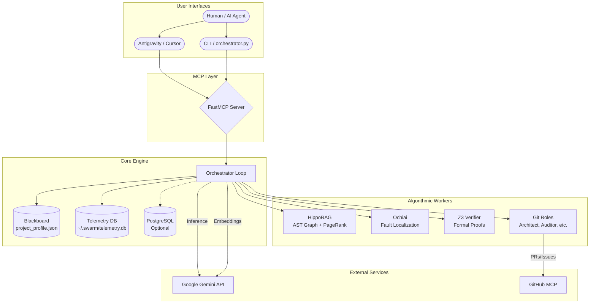

# Architecture

Vexorbis Swarm v3.4 is a Python-native, Gemini-first autonomous AI development orchestrator. It unifies state management, algorithmic reasoning, telemetry-backed memory, and a multi-role autonomous Git engine into a single, cohesive MCP server.

---

## System Overview



---

## Core Components

### 1. Orchestrator Protocol
**Location:** `mcp_core/orchestrator_loop.py`

The central event loop that manages:
*   **Task Lifecycle**: PENDING → IN_PROGRESS → COMPLETED/FAILED.
*   **Algorithm Dispatch**: Routes tasks to HippoRAG, SBFL, Z3, or Git based on flags.
*   **Provenance Logging**: Every action is tracked for auditability.

### 2. LLM Router
**Location:** `mcp_core/llm.py`

Gemini-first model cascade with automatic fallback:
1.  `gemini-2.5-flash` (Primary)
2.  `gemini-2.5-pro` (Fallback for complex tasks)
3.  `ollama/llama3` (Optional local model)

### 3. Blackboard State
**Location:** `project_profile.json` + `mcp_core/swarm_schemas.py`

*   **Pydantic Models**: Strict typing for all state objects (Tasks, Provenance, Config).
*   **FileLock**: Cross-platform, process-safe concurrent access.
*   **Sync Engine**: Bi-directional sync with `docs/ai/PLAN.md` for human-readable roadmaps.

### 4. Telemetry & Memory
**Location:** `mcp_core/telemetry/`

| Module | Purpose |
|--------|---------|
| `collector.py` | Event buffering and provenance tracking. |
| `memory_store.py` | SQLite-backed context persistence across sessions. |
| `self_healing.py` | Detects repeated failures and injects `SYSTEM_ALERT` into agent context. |
| `telemetry_analytics.py` | Queries historical data for tool performance and circuit breakers. |

### 5. Sync Engine (Antigravity Bridge)
**Location:** `mcp_core/sync/`

| Module | Purpose |
|--------|---------|
| `sync_engine.py` | Inbound/Outbound sync between `PLAN.md` and the Blackboard. |
| `markdown_bridge.py` | Parses and generates Markdown task checklists. |

---

## Algorithm Workers

### HippoRAG Retriever
**Location:** `mcp_core/algorithms/hipporag_retriever.py`

Builds an Abstract Syntax Tree (AST) knowledge graph and uses Personalized PageRank for deep code understanding.

*   **Languages**: Python (built-in `ast`), JavaScript, TypeScript, Go, Rust (via Tree-sitter).
*   **Parsers**: `mcp_core/algorithms/parsers/` (plugin system).

### Ochiai SBFL
**Location:** `mcp_core/algorithms/ochiai_localizer.py`

Statistical fault localization that identifies the most "suspicious" lines of code based on test coverage data.

### Z3 Verifier
**Location:** `mcp_core/algorithms/z3_verifier.py`

Formal verification using the Z3 SMT solver. Generates invariant checks for critical functions.

> [!WARNING]
> **Status: Partial.** Core integration complete; high-level constraint generators are stubbed.

### Git Roles
**Location:** `mcp_core/algorithms/git_roles/`

A multi-agent system for autonomous repository maintenance:
*   `FeatureScout`: Identifies expansion opportunities.
*   `CodeAuditor`: Finds bugs and documentation drift.
*   `IssueTriage`: Prioritizes backlog items.
*   `BranchManager`: Orchestrates PRs and merges.

> [!WARNING]
> **Status: Experimental.** Role behaviors implemented but require real-world validation.

---

## File Structure

```
swarm/
├── server.py                 # FastMCP Server Entrypoint
├── Dockerfile                # Python 3.11 Slim Image
├── project_profile.json      # The Blackboard (State)
│
├── mcp_core/
│   ├── orchestrator_loop.py  # Main Event Loop
│   ├── llm.py                # Gemini Router & Fallback Logic
│   ├── search_engine.py      # Python Hybrid Search & Indexing
│   ├── swarm_schemas.py      # Pydantic State Models
│   ├── postgres_client.py    # Optional SQL Persistence
│   │
│   ├── algorithms/
│   │   ├── hipporag_retriever.py
│   │   ├── ochiai_localizer.py
│   │   ├── z3_verifier.py
│   │   ├── git_worker.py
│   │   ├── git_role_dispatcher.py
│   │   ├── debate_engine.py
│   │   ├── voting_consensus.py
│   │   ├── context_pruner.py
│   │   └── parsers/          # Multi-language AST (Python, JS, TS)
│   │
│   ├── telemetry/
│   │   ├── collector.py
│   │   ├── memory_store.py
│   │   ├── self_healing.py
│   │   └── telemetry_analytics.py
│   │
│   ├── sync/
│   │   ├── sync_engine.py
│   │   └── markdown_bridge.py
│   │
│   └── tools/
│       ├── dynamic/          # Runtime-loaded tools
│       │   ├── deliberation.py
│       │   └── ...
│       └── system/           # Core MCP tool definitions
│
└── docs/
    ├── ai/                   # AI Agent documentation
    └── human/                # Human developer documentation
```

---

## Component Maturity Matrix

|Component|Status|Notes|
|---|---|---|
|**Orchestrator Protocol**|✅ Stable|Core state machine and event loop.|
|**LLM Router**|✅ Stable|Gemini-first with provider cascading.|
|**Search Engine**|✅ Stable|Hybrid Keyword/Semantic (~1ms keyword).|
|**HippoRAG Retriever**|✅ Stable|Multi-language AST graph.|
|**Ochiai Debugger**|✅ Stable|Statistical fault localization.|
|**Telemetry & Memory**|✅ Stable|SQLite-backed persistence & self-healing.|
|**Sync Engine**|✅ Stable|PLAN.md bi-directional sync.|
|**Z3 Verifier**|⚠️ Partial|Solver wrapper complete; constraint generation pending.|
|**Git Agent Roles**|⚠️ Experimental|Roles defined & active; core behaviors implemented.|
|**Deliberation Tool**|⚠️ Experimental|Structured workflow active; workers simulated via LLM.|
