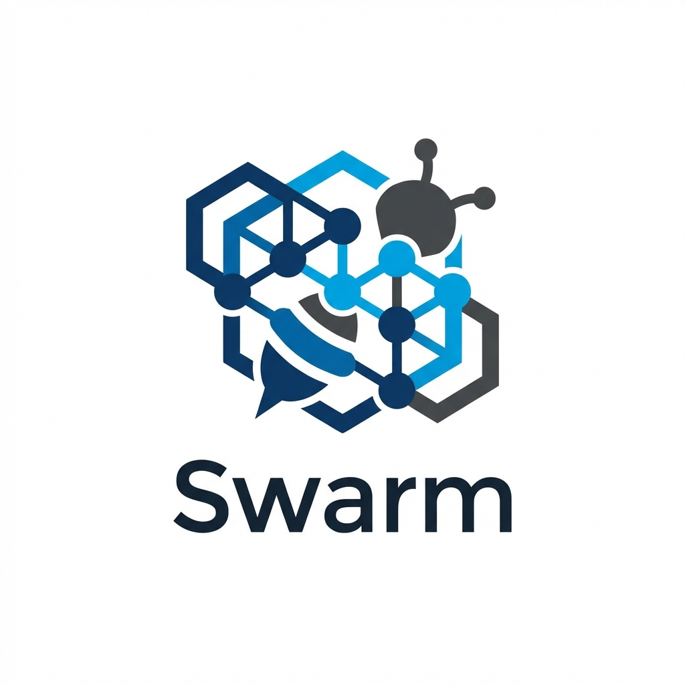
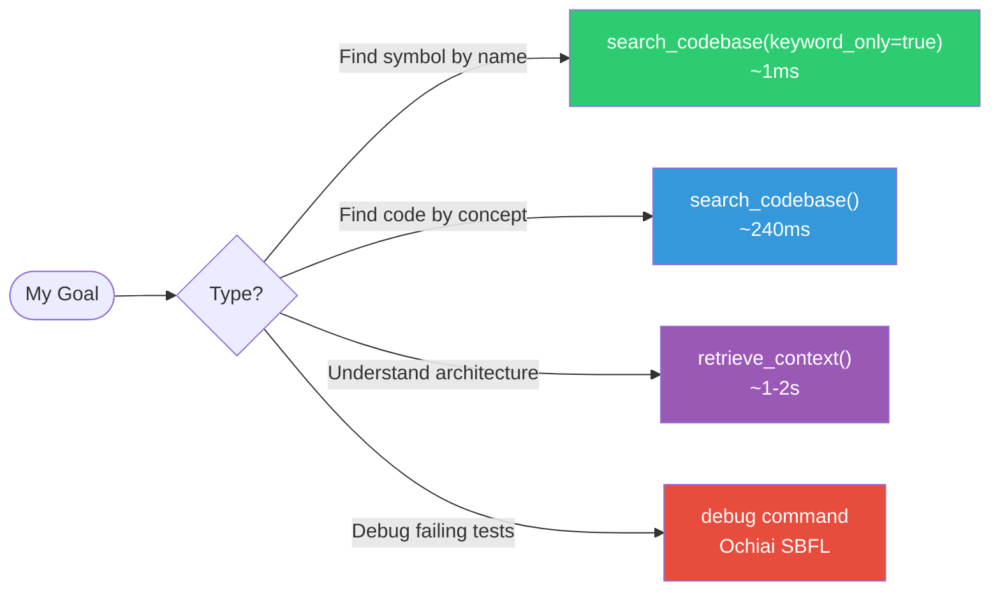

<div align="center">
  

  # Vexorbis Swarm v3.4

  ### Turn your IDE into an Autonomous Engineering Team

  [](https://python.org)
  [](https://docker.com)
  [](https://modelcontextprotocol.io)
  [](LICENSE)

</div>

---

## What is Swarm?

**Swarm** is a Model Context Protocol (MCP) server that extends AI coding assistants like Antigravity, Cursor, and Claude Desktop with **deterministic, algorithmic capabilities**. Instead of relying purely on LLM reasoning, Swarm uses specialized workers code analysis, fault localization, formal verification, and autonomous Git management to deliver faster, more reliable results.

---

## ✨ The Three Pillars

<table>
<tr>
<td width="33%" valign="top">

### 🧠 Algorithmic Core

> **Go beyond text search.**

*   **HippoRAG**: AST-based knowledge graphs with Personalized PageRank for deep code understanding.
*   **Ochiai SBFL**: Find bugs statistically, not by guessing.
*   **Z3 Verifier**: Formal verification for critical logic.

</td>
<td width="33%" valign="top">

### 🤖 Autonomous Workforce

> **Let the agents handle the grunt work.**

*   **Git Agent Roles**: Specialized workers (Architect, Engineer, Auditor) that plan, commit, and create PRs.
*   **Dynamic Toolsmith**: Swarm can design and register new tools at runtime.
*   **Markdown-Driven**: Control the workforce from a `PLAN.md` file.

</td>
<td width="33%" valign="top">

### 🛡️ Active Governance

> **Stay in control.**

*   **Telemetry Memory**: SQLite-backed persistence for session context and failure analysis.
*   **Self-Healing**: Detects repeated failures and alerts agents to change strategy.
*   **Permission-First**: Autonomous actions (like tool creation) require user approval.

</td>
</tr>
</table>

---

## 🚀 Quick Start

### Docker (Recommended)

```bash
git clone https://github.com/projectvgony/Vexorbis.git
cd Vexorbis
cp .env.example .env   # Add your GEMINI_API_KEY (and optionally GITHUB_TOKEN)
docker compose up -d --build
```

### Configure Your IDE

Add the MCP server to your IDE's configuration (e.g., `~/.antigravity/settings.json`):

```json
{
  "mcpServers": {
    "swarm-orchestrator": {
      "command": "docker",
      "args": ["exec", "-i", "swarm-mcp-server", "fastmcp", "run", "server.py"]
    }
  }
}
```

---

## 🔍 Tool Selection Guide



---

## 🔄 Antigravity Sync

Swarm synchronizes with a human-readable `PLAN.md` file, enabling a true co-pilot workflow.

**From Your Markdown:**
```markdown
## Todo
- [ ] Refactor auth module @architect
  - Context: auth.py
- [ ] Add login tests @engineer
```

**Swarm interprets:**
*   `[ ]` → Task is `PENDING`. Agent picks it up.
*   `@architect` → Assigns to the Architect worker.
*   `Context:` → Pre-loads `auth.py` into the agent's window.

**On completion:**
*   Agent marks the task `[x]` in your `PLAN.md` automatically.

---

## 📖 Documentation

| Getting Started | Concepts | Guides | Reference |
|-----------------|----------|--------|-----------|
| [Introduction](docs/human/getting-started/introduction.md) | [Architecture](docs/human/concepts/architecture.md) | [PLAN.md Syntax](docs/human/guides/plan-syntax.md) | [Tools](docs/human/reference/tools.md) |
| [Installation](docs/human/getting-started/installation.md) | [Decision Logic](docs/human/concepts/decision-logic.md) | [Git Workflows](docs/human/guides/git-workflows.md) | [Configuration](docs/human/reference/configuration.md) |
| [Quick Start](docs/human/getting-started/quickstart.md) | [Three Pillars](docs/human/concepts/three-pillars.md) | [Debugging](docs/human/guides/debugging.md) | [API Reference](docs/human/reference/api.md) |
| | | [Custom Tools](docs/human/guides/custom-tools.md) | [Troubleshooting](docs/human/reference/troubleshooting.md) |

---

## 📊 Implementation Status

| Component | Status |
|-----------|--------|
| HippoRAG (Multi-language AST) | ✅ Stable |
| Hybrid Search Engine | ✅ Stable |
| Ochiai SBFL | ✅ Stable |
| Telemetry & Memory | ✅ Stable |
| Git Agent Roles | 🚧 Experimental |
| Z3 Verifier | ⚠️ Partial |
| Structured Deliberation | 🚧 Stub |

---

## 🤝 Contributing

We welcome contributions! See [CONTRIBUTING.md](CONTRIBUTING.md).

**Development Mode:**
```bash
# Enable debug features
export SWARM_DEBUG=true
export SWARM_VERBOSE_TELEMETRY=true
```

---

## 📜 License

MIT License - See [LICENSE](LICENSE) for details.
