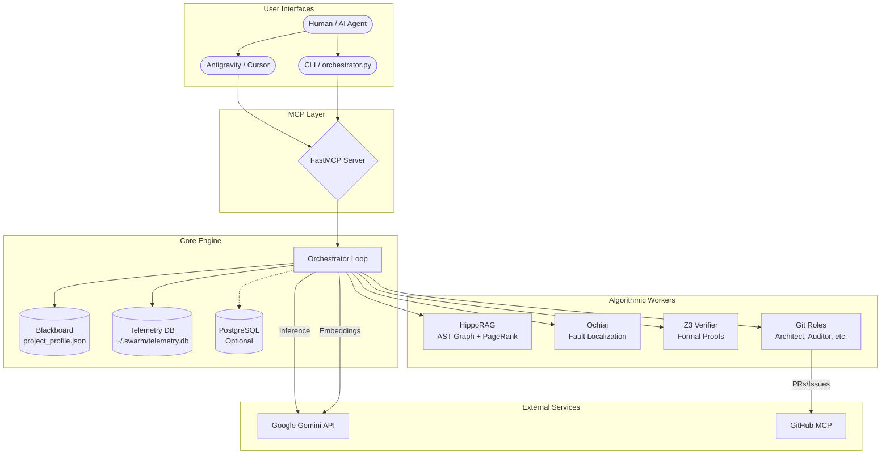

# Architecture Overview

Swarm is a Python-native MCP server that combines state management, algorithmic reasoning, and autonomous workflows.

## System Diagram



## Core Components

### Orchestrator (`mcp_core/orchestrator_loop.py`)

The central event loop that manages:
- **Task Lifecycle**: PENDING → IN_PROGRESS → COMPLETED/FAILED
- **Algorithm Dispatch**: Routes tasks to specialized workers based on flags
- **Provenance Logging**: Every action is tracked for auditability
- **Session Persistence**: State survives restarts via SQLite/PostgreSQL

### Blackboard (`project_profile.json`)

The shared state file containing:
- Current tasks and their status
- Memory bank for cross-session context
- Worker model configurations
- Stack fingerprint (detected languages/frameworks)

### Telemetry System (`mcp_core/telemetry/`)

| Module | Purpose |
|--------|---------|
| `collector.py` | Event buffering and provenance tracking |
| `memory_store.py` | SQLite-backed context persistence |
| `self_healing.py` | Detects repeated failures, injects SYSTEM_ALERT |
| `telemetry_analytics.py` | Queries historical data for tool performance |

### Sync Engine (`mcp_core/sync/`)

Bi-directional synchronization between `PLAN.md` and the Blackboard:
- **Inbound**: Human edits PLAN.md → Updates Swarm tasks
- **Outbound**: Agent completes work → Marks tasks `[x]` in PLAN.md

## File Structure

```
swarm/
├── server.py                 # FastMCP Server Entrypoint
├── Dockerfile                # Python 3.11 Slim Image
├── project_profile.json      # The Blackboard (State)
│
├── mcp_core/
│   ├── orchestrator_loop.py  # Main Event Loop
│   ├── llm.py                # Gemini Router & Fallback Logic
│   ├── search_engine.py      # Hybrid Search & Indexing
│   ├── swarm_schemas.py      # Pydantic State Models
│   ├── postgres_client.py    # Optional SQL Persistence
│   │
│   ├── algorithms/
│   │   ├── hipporag_retriever.py
│   │   ├── ochiai_localizer.py
│   │   ├── z3_verifier.py
│   │   ├── git_worker.py
│   │   ├── git_role_dispatcher.py
│   │   └── parsers/          # Multi-language AST
│   │
│   ├── telemetry/
│   │   ├── collector.py
│   │   ├── memory_store.py
│   │   ├── self_healing.py
│   │   └── telemetry_analytics.py
│   │
│   ├── sync/
│   │   ├── sync_engine.py
│   │   └── markdown_bridge.py
│   │
│   └── tools/
│       ├── dynamic/          # Runtime-loaded tools
│       └── system/           # Core MCP tools
│
└── docs/
    └── (documentation)
```

---

## Next Steps

- [Decision Logic](./decision-logic.md) — How routing works
- [The Three Pillars](./three-pillars.md) — Core design principles
