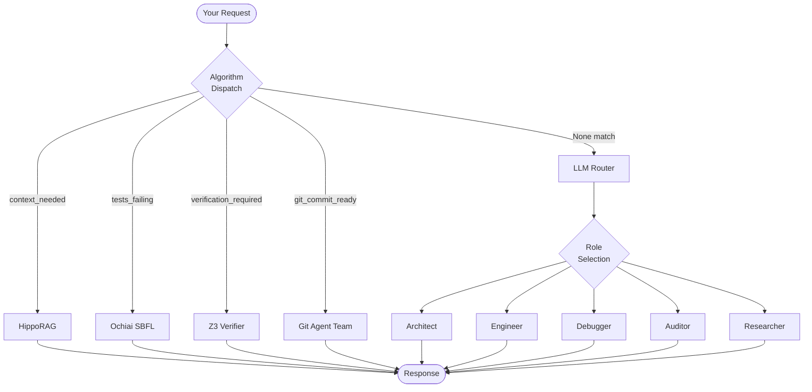

# Decision Logic

How Swarm decides what to do with your request.

## The Routing Flow



## Algorithm Dispatch (Priority Order)

Before using an LLM, Swarm checks for specialized algorithms:

| Priority | Flag | Algorithm | What It Does |
|:--------:|------|-----------|--------------|
| 1 | `context_needed` | HippoRAG | AST graph search with PageRank |
| 2 | `requires_consensus` | VotingConsensus | Multi-agent weighted voting |
| 3 | `requires_debate` | DebateEngine | Ring-topology debate session |
| 4 | `verification_required` | Z3 Verifier | Formal proof of invariants |
| 5 | `tests_failing` | Ochiai SBFL | Statistical fault localization |
| 6 | `git_commit_ready` | Git Team | Autonomous commit/PR workflow |

> **Key Point:** If an algorithm handles the task, the LLM is never called.

## LLM Router

When no algorithm matches, Swarm uses a **Gemini-First Cascade**:

```
1. gemini-3-flash-preview  (Primary - fastest)
       ↓ (if fails)
2. gemini-2.5-flash        (Fallback - stable)
       ↓ (if fails)
3. gemini-2.5-pro          (Fallback - complex reasoning)
       ↓ (if fails)
4. gpt-4o                   (Final fallback)
       ↓ (if no keys)
5. Mock Response            (Demo mode)
```

### Local LLM Support

Use aliases to route to local models:
- `ollama/llama3` → Ollama at `localhost:11434`
- `lmstudio/codestral` → LM Studio at configured URL

## Role Selection

When the LLM handles a task, Swarm assigns a persona:

| Condition | Role | Focus |
|-----------|------|-------|
| `task.assigned_worker` set | User's choice | Explicit assignment via `@role` |
| `tests_failing` is True | Debugger | Stack traces, root cause |
| "research", "investigate" in task | Researcher | Broad search, synthesis |
| "plan", "architecture" in task | Architect | Design, constraints |
| "audit", "security" in task | Auditor | Vulnerabilities, style |
| Default | Engineer | Implementation |

## Role Handoff

Agents can request handoff to another role:

```xml
<handoff_to role="researcher">
  Need more context about the payment API
</handoff_to>
```

The Orchestrator creates a new task assigned to the target role.

---

## Next Steps

- [Three Pillars](./three-pillars.md) — Design principles
- [Tools Reference](../reference/tools.md) — Available tools
