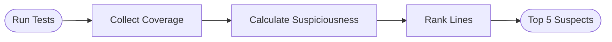

# Debugging with Ochiai

Statistical fault localization to find bugs faster.

## What is Ochiai SBFL?

Spectrum-Based Fault Localization (SBFL) uses test coverage data to calculate which lines are most likely to contain bugs.

**Key insight:** Lines executed by failing tests but not by passing tests are suspicious.

## How It Works



### The Ochiai Formula

```
suspiciousness = failed(line) / sqrt(total_failed * (failed(line) + passed(line)))
```

- `failed(line)`: Tests that failed and executed this line
- `passed(line)`: Tests that passed and executed this line
- `total_failed`: Total number of failing tests

## Triggering Ochiai

### Automatic

When Swarm detects failing tests:
```markdown
- [ ] Fix authentication bug @debugger
  - Flags: tests_failing=True
```

### Manual

```
My tests are failing, help me find the bug
```

### Environment Flag

```bash
export SWARM_SBFL_ENABLED=true
```

## Reading the Report

Ochiai outputs a ranked list:

```
🔍 SBFL Analysis Results

Top 5 Most Suspicious Lines:
1. src/auth/login.py:47    (0.92) - if user.password == input_password:
2. src/auth/login.py:52    (0.85) - return session.create(user)
3. src/auth/session.py:23  (0.71) - self.expiry = datetime.now()
4. src/auth/user.py:18     (0.45) - self.role = role or "user"
5. src/auth/login.py:38    (0.32) - user = db.query(User).filter_by(email=email)
```

**Score Interpretation:**
- 0.8-1.0: Very suspicious — check immediately
- 0.5-0.8: Moderately suspicious — likely related
- 0.0-0.5: Low suspicion — probably not the cause

## Workflow Example

1. **Tests fail:** `pytest` shows 3 failures
2. **Request help:** "Debug my failing tests"
3. **Swarm runs Ochiai:** Analyzes coverage
4. **Get report:** Lines 47 and 52 are most suspicious
5. **Focus there:** Agent examines those specific lines
6. **Find bug:** Plaintext password comparison on line 47
7. **Fix:** Replace with `bcrypt.checkpw()`

## Requirements

- `coverage` module installed
- Test suite that can be run with `pytest` or `unittest`
- Source files in Python (other languages planned)

## Configuration

Set the test command if not using pytest:

```json
// project_profile.json
{
  "toolchain_config": {
    "test_command": "python -m unittest discover"
  }
}
```

---

## Next Steps

- [Creating Custom Tools](./custom-tools.md) — Extend Swarm
- [Troubleshooting](../reference/troubleshooting.md) — Common issues
