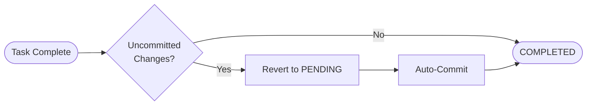

# Autonomous Git Workflows

Swarm can manage your Git workflow autonomously.

## Overview

The Git Agent Team handles:
- Generating commit messages
- Creating branches
- Opening pull requests
- Managing the merge queue

## Triggering Git Actions

### Via PLAN.md Flags

```markdown
- [ ] Add user validation @engineer
  - Flags: git_commit_ready=True
```

### Via Direct Request

```
Commit my changes with an appropriate message
```

## The Git Agents

### Feature Scout

**Trigger:** `feature_discovery=True`

Scans your codebase for:
- TODO/FIXME comments
- Low-connectivity modules (orphaned code)
- High-churn files

**Output:** Creates GitHub issues or `docs/ai/issues.md` entries

### Code Auditor

**Trigger:** `code_audit=True`

Performs:
- Security pattern scanning
- Style violation checks
- Git diff analysis

**Output:** Markdown audit report with findings

### Issue Triage

**Trigger:** `issue_triage_needed=True`

Prioritizes your backlog:
- P0: Critical (security, data loss)
- P1: High (broken features)
- P2: Medium (bugs, improvements)
- P3: Low (nice-to-have)

**Output:** Updated issue labels and priority suggestions

### Branch Manager

**Trigger:** `git_create_pr=True`

Handles:
- PR creation with generated description
- Merge queue management
- Stale branch pruning

## Strict Git Mode

**Default:** `SWARM_STRICT_GIT=true`

Prevents "dirty state" completion:



**Rule:** A task cannot be marked COMPLETED with uncommitted changes.

**Behavior:**
1. Swarm reverts status to PENDING
2. Triggers Git Agent to commit
3. Then marks COMPLETED

## Commit Message Generation

Swarm generates Conventional Commits:

```
feat(auth): add password hashing

- Implement bcrypt hashing in user.py
- Add salt generation utility
- Update create_user endpoint
```

Format: `type(scope): description`

Types: `feat`, `fix`, `docs`, `style`, `refactor`, `test`, `chore`

## Branch Naming

Branches follow the pattern: `type/short-description`

Examples:
- `feat/user-authentication`
- `fix/login-validation`
- `refactor/database-layer`

## GitHub Integration

With `GITHUB_TOKEN` set, Swarm can:
- Create issues and PRs
- Apply labels
- Request reviewers

**Configuration:**
```bash
export GITHUB_TOKEN="ghp_your_token_here"
```

---

## Next Steps

- [Debugging with Ochiai](./debugging.md) — Statistical bug finding
- [Tools Reference](../reference/tools.md) — All available tools
