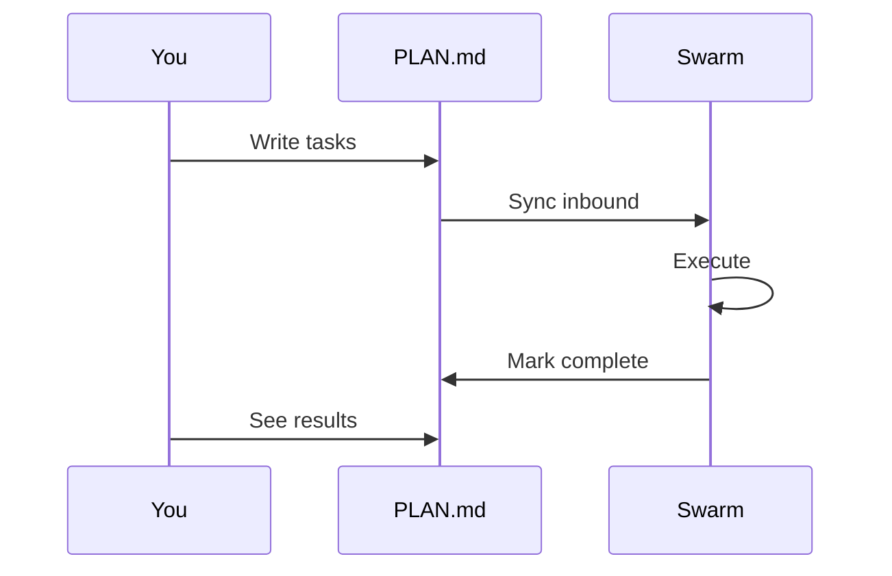

# Using PLAN.md

Control Swarm agents through a simple Markdown file.

## Overview

`PLAN.md` is a bi-directional interface between you and Swarm:



## File Location

Place `PLAN.md` in your project root or at `docs/ai/PLAN.md`.

## Basic Syntax

```markdown
# Project Roadmap

## Phase 1: Authentication
- [ ] Implement login endpoint @engineer
- [ ] Add password hashing @engineer
- [ ] Create user model @architect

## Phase 2: Testing
- [ ] Write unit tests @engineer
- [ ] Security audit @auditor
```

## Task Status Markers

| Marker | Status | Meaning |
|--------|--------|---------|
| `[ ]` | PENDING | Swarm will pick this up |
| `[/]` | IN_PROGRESS | Currently being worked |
| `[x]` | COMPLETED | Done (Swarm marks this) |
| `[-]` | SKIPPED | Ignored by Swarm |

## Role Assignment

Use `@role` to assign a specific worker:

```markdown
- [ ] Design database schema @architect
- [ ] Implement CRUD operations @engineer
- [ ] Review for SQL injection @auditor
- [ ] Fix failing tests @debugger
- [ ] Research caching options @researcher
```

## Context Loading

Pre-load files into the agent's context:

```markdown
- [ ] Refactor authentication @engineer
  - Context: src/auth/login.py, src/auth/session.py
```

Multiple files are comma-separated.

## Task Flags

Set behavior flags for tasks:

```markdown
- [ ] Add new feature @engineer
  - Flags: git_commit_ready=True, git_create_pr=True
```

Available flags:
| Flag | Effect |
|------|--------|
| `git_commit_ready` | Auto-commit changes when done |
| `git_create_pr` | Create a PR after commit |
| `verification_required` | Run Z3 verification |
| `tests_failing` | Activate Ochiai debugging |

## Nested Sub-Tasks

```markdown
- [ ] User authentication system
  - [ ] Login endpoint @engineer
  - [ ] Logout endpoint @engineer
  - [ ] Session management @architect
```

## Complete Example

```markdown
# Sprint 3: Payment Integration

## High Priority
- [x] Stripe SDK integration @engineer ✓
- [ ] Payment webhook handler @engineer
  - Context: src/payments/webhook.py
  - Flags: git_commit_ready=True

## Medium Priority
- [ ] Refund logic @engineer
- [ ] Payment audit logging @auditor
  - Context: src/payments/, src/audit/

## Low Priority
- [ ] Multi-currency support @architect
  - Flags: requires_debate=True
```

---

## Next Steps

- [Git Workflows](./git-workflows.md) — Autonomous commit and PR
- [Configuration](../reference/configuration.md) — Environment settings
